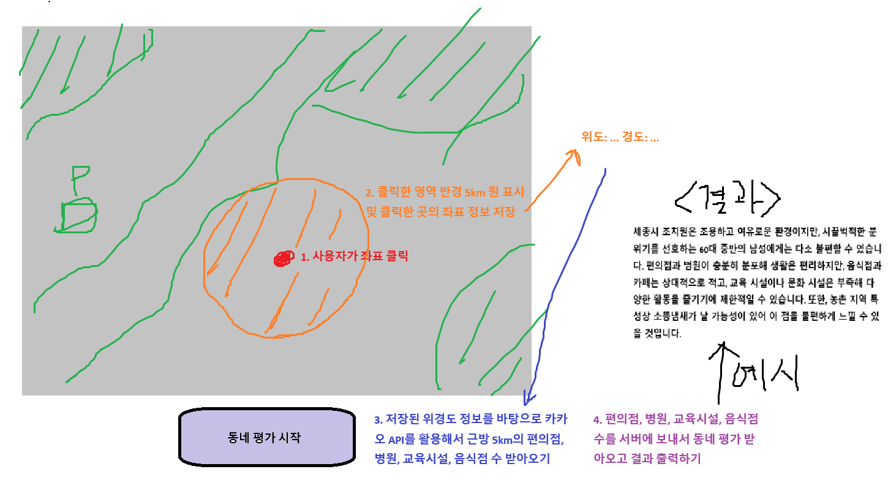

# 메인 기능 플로우

- 지도와 마커를 활용해서 실거래 정보를 제공 (지도 API 활용)
- 처음 진입했을 때, 강남 역삼을 중심으로 실거래 정보를 보여줘야 함 (서버 API 활용)
- 실거래 정보는 마커를 활용해서 보여줘야 함
- 마커에는 아파트 이름과 가격(단위: 억) 정보가 포함되어야 함
- 지역, 아파트 이름으로 검색할 수 있음 (서버 API 활용)
- 사용자는 맵의 특정 좌표를 클릭할 수 있고(클릭한 좌표 정보를 가지고 있어야 함), 클릭한 영역 반경 5km에는 원이 표시되어야 함 → 동네 평가 시 원 안에 포함된 (편의점, 병원, 교육시설, 음식점)의 개수를 카카오맵 API를 활용해 받아옴 → 서버에 동네 평가 API를 요청해서 평가를 받아옴 → 화면에 출력

# 개발 완료된 API 리스트
```
로그인
endpoint: POST /user/login

parameter: body: {
	"serviceId": string,
	"password": string
}

response: 성공 200, 실패 400
```
```
로그아웃
endpoint: POST /user/logout

response: 성공 200
```
```
회원가입
endpoint: POST /user/signup

parameter: body: {
	"serviceId": string,
	"password": string,
	"email": string,
	"preference": string[]
}

response: 성공 200, 실패 400
```
```
선호 선택 목록 조회
endpoint: GET /user/signup/preference_list

response: 성공 200, 실패 400

성공 시 응답 예시
{
	"density": ["한적함", "번화가"],
	"transport": ["자차", "대중교통"],
	"school": ["학군 중요", "학군 비중 낮음"],
	"rise": ["저층", "고층"],
	"infra": ["노후 인프라", "최신 인프라"]
}
```
```
이메일 인증번호 전송
endpoint: GET /signup/email-verification-request

param: email

요청 예시
/signup/email-verification-request?email=test@naver.com

response: 성공 200
```

# 활용 기술
SpringBoot, MySQL, MyBatis, SMTP

# 앞으로의 계획
- 매물 등록, 지도 관련 API 구현
- 이메일 인증 API 구현
- 보안 관련 책, 문서 읽고 적용

# 느낀 점
```
오승언
얼마 전까지만 하더라도 같은 기능을 구현할 때 별다른 생각 없이 구현했을 텐데, 지금 하는 관통 프로젝트에서는 보안적 요소를 고려하며 구현하는 스스로가 뿌듯했습니다. 주제를 보안으로 선정하면서 아키텍처에 대한 부분을 놓치게 된다는 점이 아쉬웠습니다. 또한 팀원과 API 명세 없이 이야기하는 것과 명세를 눈 앞에 두고 이야기하는 것이 큰 차이가 있음을 배웠습니다.
```